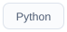

### Проекты

  <a href="https://github.com/Evolut10n11/robotci">
    <picture>
      <source media="(prefers-color-scheme: dark)" srcset="assets/profile/robotci-dark.svg" />
      
    </picture>
  </a>
  <a href="https://github.com/Evolut10n11/lumen-lab">
    <picture>
      <source media="(prefers-color-scheme: dark)" srcset="assets/profile/lumen-dark.svg" />
      
    </picture>
  </a>
  <a href="https://github.com/Evolut10n11/ElainNewLLM">
    <picture>
      <source media="(prefers-color-scheme: dark)" srcset="assets/profile/elaine-dark.svg" />
      
    </picture>
  </a>
  <a href="https://github.com/Evolut10n11/local-ai-doc-agent">
    <picture>
      <source media="(prefers-color-scheme: dark)" srcset="assets/profile/documents-dark.svg" />
      
    </picture>
  </a>

### Стек

  <picture>
    <source media="(prefers-color-scheme: dark)" srcset="assets/profile/tool-python-dark.svg" />
    
  </picture>
  <picture>
    <source media="(prefers-color-scheme: dark)" srcset="assets/profile/tool-fastapi-dark.svg" />
    
  </picture>
  <picture>
    <source media="(prefers-color-scheme: dark)" srcset="assets/profile/tool-postgresql-dark.svg" />
    
  </picture>
  <picture>
    <source media="(prefers-color-scheme: dark)" srcset="assets/profile/tool-qwen-dark.svg" />
    
  </picture>
  <picture>
    <source media="(prefers-color-scheme: dark)" srcset="assets/profile/tool-langfuse-dark.svg" />
    
  </picture>
  <picture>
    <source media="(prefers-color-scheme: dark)" srcset="assets/profile/tool-github-actions-dark.svg" />
    
  </picture>

RAG · агенты · tool calling · REST API · webhooks · оценка ответов

<b>Статистика GitHub</b>

 

  <picture>
    <source media="(prefers-color-scheme: dark)" srcset="assets/metrics/stats-dark.svg" />
    
  </picture>
  <picture>
    <source media="(prefers-color-scheme: dark)" srcset="assets/metrics/languages-dark.svg" />
    
  </picture>

  <picture>
    <source media="(prefers-color-scheme: dark)" srcset="https://raw.githubusercontent.com/Evolut10n11/Evolut10n11/output/github-contribution-grid-snake-dark.svg" />
    
  </picture>

