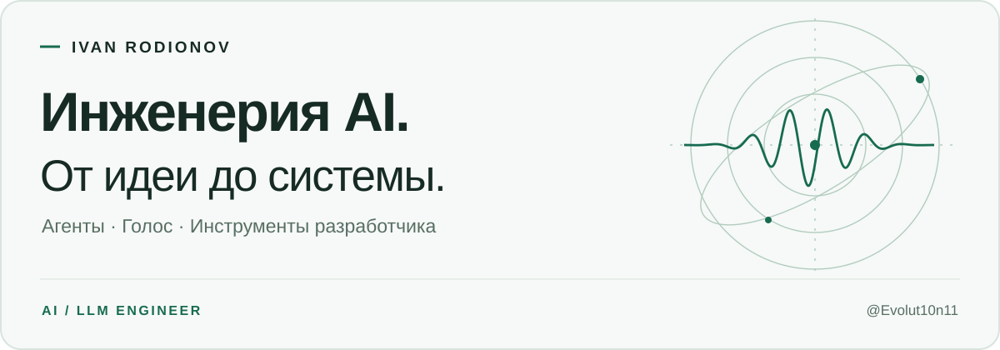
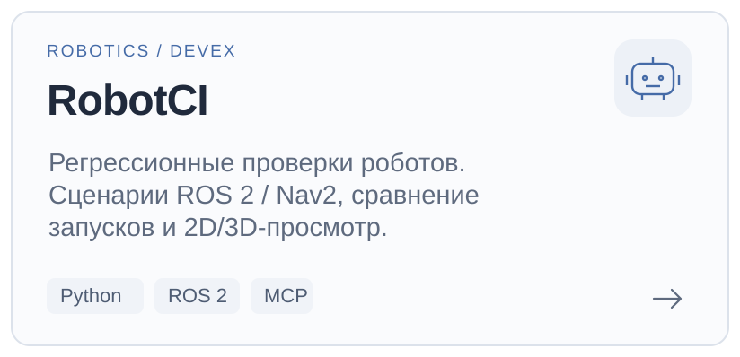
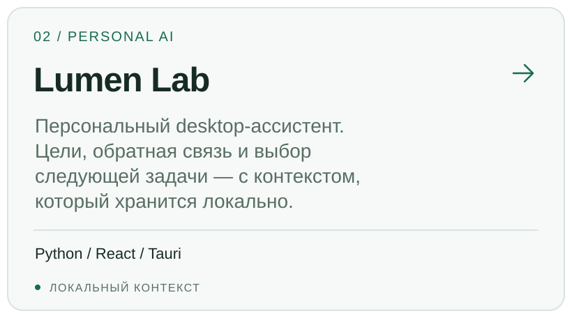
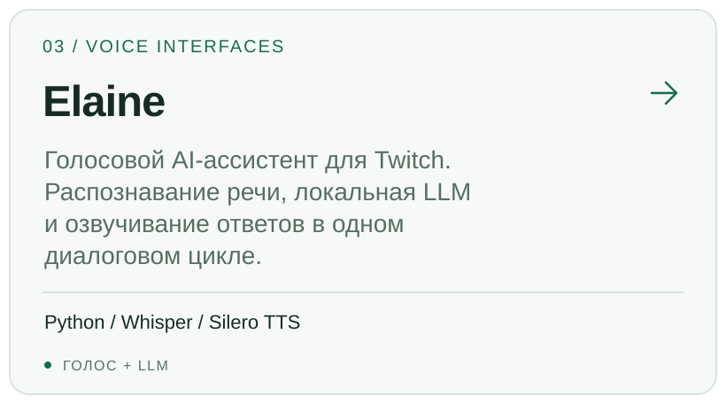
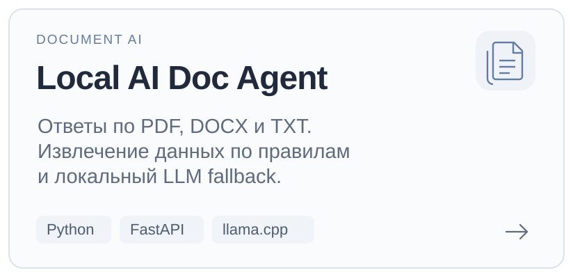
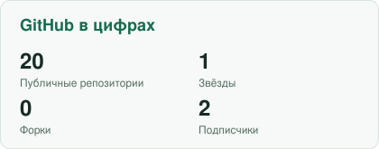
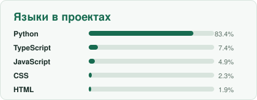

<picture>
  <source media="(max-width: 600px) and (prefers-color-scheme: dark)" srcset="assets/profile/hero-mobile-dark.svg" />
  <source media="(max-width: 600px)" srcset="assets/profile/hero-mobile-light.svg" />
  <source media="(prefers-color-scheme: dark)" srcset="assets/profile/hero-dark.svg" />
  
</picture>

  

**Привет, я Иван.** Разрабатываю AI-ассистентов, голосовые интерфейсы и инструменты для разработчиков. Работаю над тем, чтобы за ответом модели стояла понятная система: с API, проверками, наблюдаемостью и воспроизводимым поведением.

  <a href="https://github.com/Evolut10n11?tab=repositories">Все репозитории ↗</a>
  &nbsp; · &nbsp;
  <a href="#избранные-проекты">Избранные проекты</a>
  &nbsp; · &nbsp;
  <a href="#инструменты-и-подходы">Стек и подходы</a>

## Избранные проекты

  <a href="https://github.com/Evolut10n11/robotci">
    <picture>
      <source media="(prefers-color-scheme: dark)" srcset="assets/profile/robotci-dark.svg" />
      
    </picture>
  </a>
  <a href="https://github.com/Evolut10n11/lumen-lab">
    <picture>
      <source media="(prefers-color-scheme: dark)" srcset="assets/profile/lumen-dark.svg" />
      
    </picture>
  </a>
  <a href="https://github.com/Evolut10n11/ElainNewLLM">
    <picture>
      <source media="(prefers-color-scheme: dark)" srcset="assets/profile/elaine-dark.svg" />
      
    </picture>
  </a>
  <a href="https://github.com/Evolut10n11/local-ai-doc-agent">
    <picture>
      <source media="(prefers-color-scheme: dark)" srcset="assets/profile/documents-dark.svg" />
      
    </picture>
  </a>

## Инструменты и подходы

| Направление | С чем работаю |
| :--- | :--- |
| **AI / LLM** | Python · RAG · агенты · tool calling · structured output · оценка ответов |
| **Сервисы и интеграции** | FastAPI · REST API · webhooks · PostgreSQL |
| **Качество и наблюдаемость** | pytest · GitHub Actions · Langfuse · трассировка · fallback |
| **Голос и локальные модели** | Whisper · TTS · Qwen · OpenAI-compatible API |

Меня интересует весь путь: **данные → модель → действие → проверка результата**.

<b>GitHub в цифрах</b>

 

  <picture>
    <source media="(prefers-color-scheme: dark)" srcset="assets/metrics/stats-dark.svg" />
    
  </picture>
  <picture>
    <source media="(prefers-color-scheme: dark)" srcset="assets/metrics/languages-dark.svg" />
    
  </picture>

  <picture>
    <source media="(prefers-color-scheme: dark)" srcset="https://raw.githubusercontent.com/Evolut10n11/Evolut10n11/output/github-contribution-grid-snake-dark.svg" />
    
  </picture>

---

IVAN RODIONOV &nbsp; / &nbsp; AI · VOICE · DEVELOPER TOOLS

